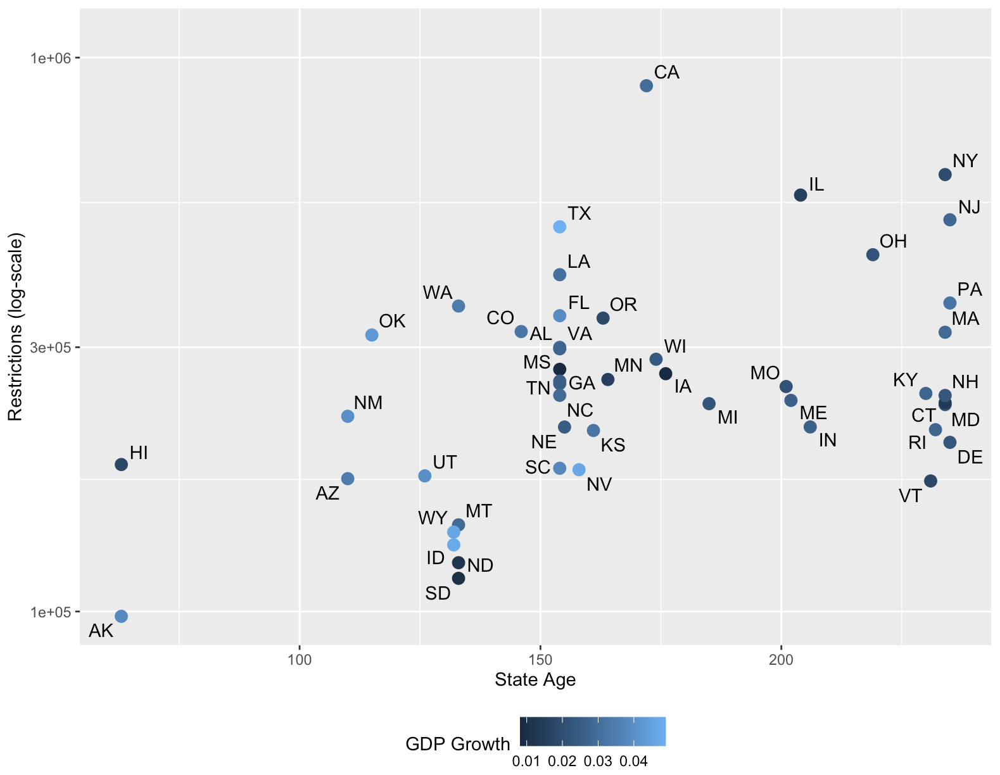

# Economic Research

---

## Working Papers

### [Cost of Regulatory Accumulation: US States' Age as Identification](https://johnthwong.github.io/pdf/paper_olson.pdf)
I'm writing a paper with **[Patrick McLaughlin](https://www.mercatus.org/scholars/patrick-mclaughlin)** on using state age to create an exogenous variation in regulatory accumulation. This project leverages the QuantGov project's **[State RegData](https://www.reghub.ai/data/bulk)**.
 
 

 
 

### A Lot of the Federal Debt is Interest
We know that each year, net interest costs on the federal debt is about 2 percent of GDP. But how does this add up over the years? How much of the federal debt comes from accumulated interest on past deficits, and is the amount larger than annual deficits? And how much interest is attributable to accumulated past interest? (Forthcoming)
 
 

---

## Works in Progress

### How Complex Has the Tax Code Become? A Measure Derived from Tax Liability
Using publicly-available consumer expenditure data and NBER's TAXSIM program, I construct a direct empirical measure of tax code complexity that encompasses the incidence of all federal and state taxes and the utilization of all deductions and credits.
 
 

### How Monopolistic is iMessage?
To what extent does iMessage confer a monopolistic advantage to Apple? I estimate how much the service changes the demand elasticity for iPhones.
 
 

### Social Security: Cost-Benefit Measured as Expected Spending Per Unit of Risk Reduction
I investigate whether various Social Security programs, in conjunction, provide additional value of risk insurance per dollar that is overlooked by separate evaluations of each program. I am using Health and Retirement Study panel data to examine how much the beneficiaries of retirement and disability income payments overlap.
 
 

### [What Is the Cause of Interest Rate Volatility in Interbank Markets?](https://johnthwong.github.io/pdf/paper_dw.pdf)
I demonstrate in this analysis that contrary to conventional wisdom, interest rate volatility isn't caused by liquidity crunches subsequent to initial public offerings. [Read more](https://johnthwong.github.io/pdf/paper_dw.pdf)

**When HIBOR (red) Breaches the Base Rate (blue)**

 
 

### Estimating the Effects of Regulation on the Demand for STEM
The count of regulatory restrictions on the financial services industry is highest compared to all other industries. The industry has also seen the third-highest average growth in restrictions in the past two decades. Despite this, labor productivity in financial services has also grown faster than in other sectors. The contribution of this paper is to explain this joint phenomena of regulatory and productivity growth in finance.

With Christos Makridis and Patrick McLaughlin.
 
 

### Income Mobility and Regulation: Evidence from Canadian Immigrants
Using a panel of measures of immigrant mobility from Statistics Canada and a shift-share instrument, we measure how much liberalization affects immigrants' economic outcomes.

With Vincent Geloso and James Dean.
 
 

---

## Past Projects

### [Web Scraper for Subsidized Housing Transaction Data](https://github.com/johnthwong/housing-authority-scraper)
The Housing Authority's data on subsidized housing transactions is notoriously difficult to access as the data must be requested by month, each with a separate web form. So I developed a scraper that automatically submits forms and gathers transaction count in each month into one spreadsheet. 

Built with Python and Selenium. Check it out here: [https://github.com/johnthwong/housing-authority-scraper](https://github.com/johnthwong/housing-authority-scraper)
 
 

 
 

### [Visualization of the Hong Kong's Forex Reserves](https://github.com/johnthwong/hkma)
After a drop in the balances of accounts held at the central bank by commercial banks (aka "Aggregate Balance") in the summer of 2022, there was **[panic](https://www.bloomberg.com/news/articles/2022-07-26/hong-kong-liquidity-shrinks-50-since-may-amid-currency-defense)** that Hong Kong's currency peg with the USD would break. In response, I wrote an internal report on why "Aggregate Balance" is insignificant and not worth freaking out about.
 
 
This project uses the Hong Kong Monetary Authority's JSON API. Data manipulation and visualization are done with R's dplyr and ggplot libraries.
 
 
Check out a similar coding file that generated the visualization below here: [https://github.com/johnthwong/hkma](https://github.com/johnthwong/hkma)
 
 

 
 

### [Give US Public Housing Residents the Right to Buy Their Flat](https://johnthwong.github.io/page_tpo)
I submitted a policy memo to the Federation of American Scientists' call for federal policy ideas for increasing housing supply. By selling public housing units, we can unlock currently non-transferrable land value, increase homeownership, create new wealth that accrues to the poor, improve state and local public finances, free up units under the Faircloth Limit, and most of all, increase housing supply. [Read more](https://johnthwong.github.io/page_tpo)
 
 

Photo by <a href="https://unsplash.com/@sigmund?utm_source=unsplash&utm_medium=referral&utm_content=creditCopyText">Sigmund</a> on <a href="https://unsplash.com/photos/CwTfKH5edSk?utm_source=unsplash&utm_medium=referral&utm_content=creditCopyText">Unsplash</a>  

---

## Non-Econ Projects

### [Reclassifying Civil Servants as Political Appointees Is Just Bad](https://www.progressivepolicy.org/blogs/trumps-schedule-f-would-transform-the-civil-service-to-weaponize-government/)
I co-authored a short piece, published with Progressive Policy Institute, highlighting the *most* insidious part of the 45th's agenda for a potential second term: Schedule F.

### [Can a Coherent Free Speech Regime Allow Incitement?](https://philpapers.org/rec/WONCRM)
My political philosophy thesis where I do conceptual analysis on legal rights. Received an A+. As of August 2024, it has been downloaded over 200 times(!), placing it in the top decile of all political philosophy papers.