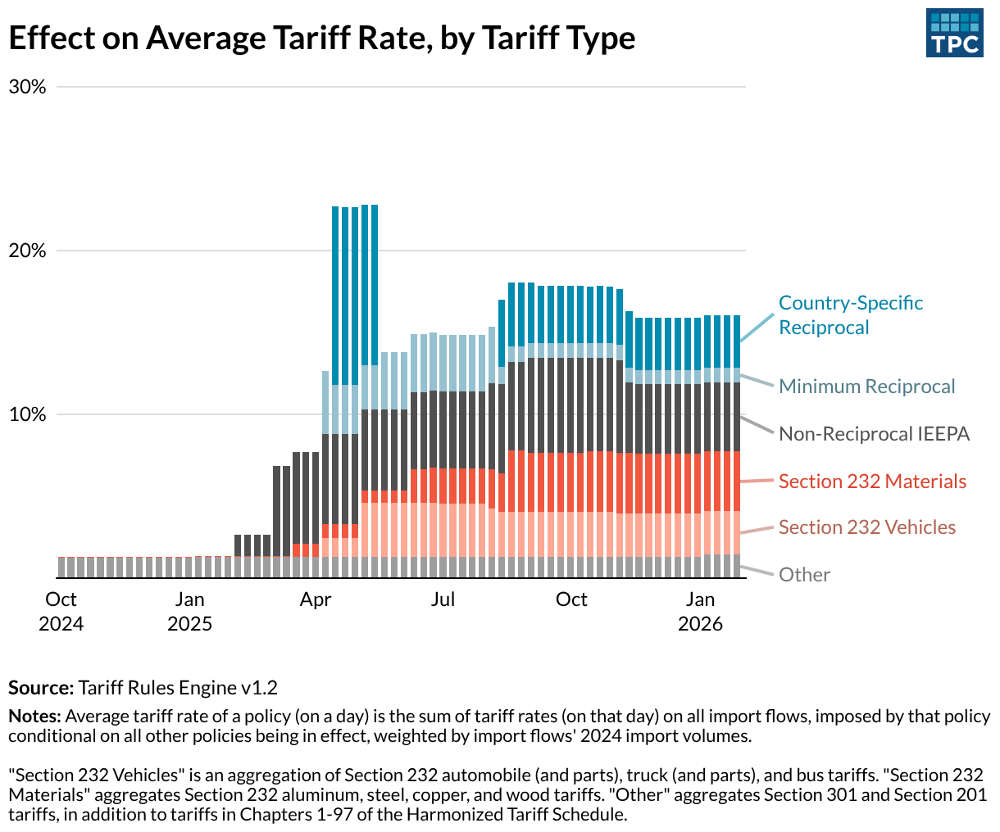
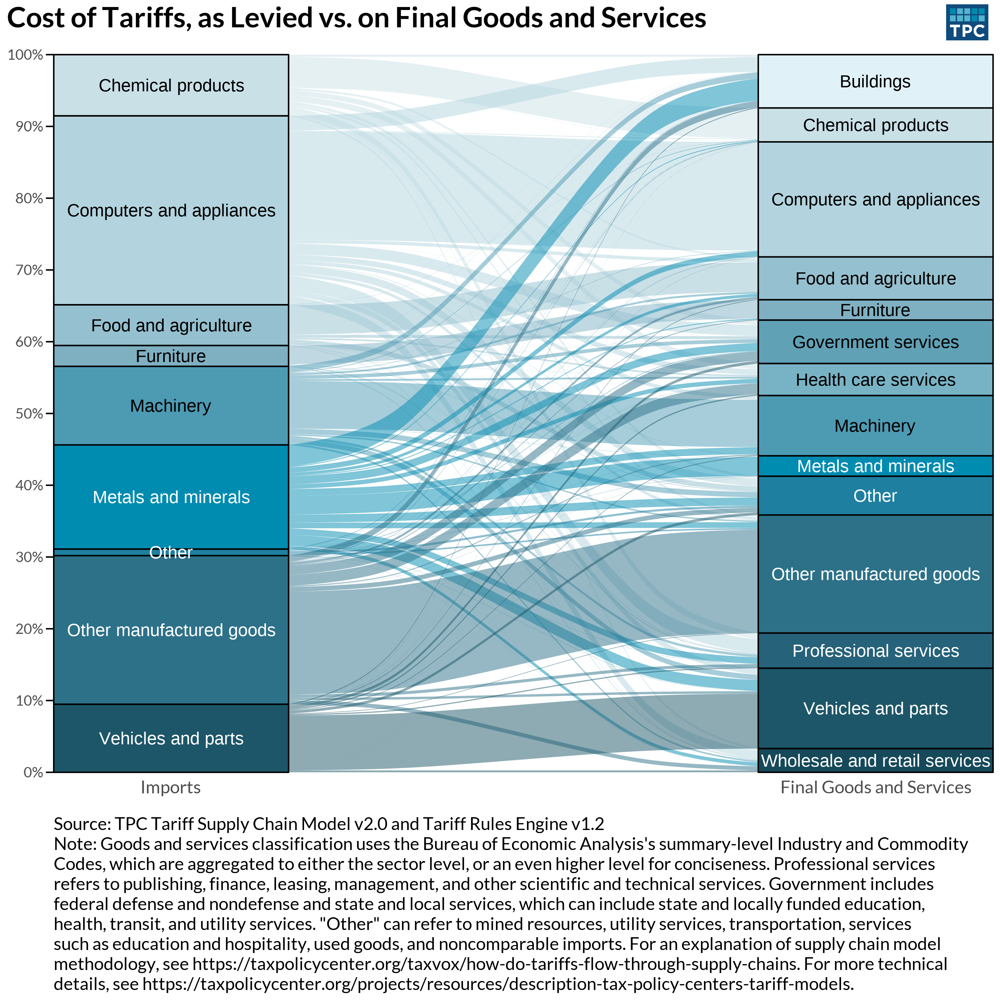
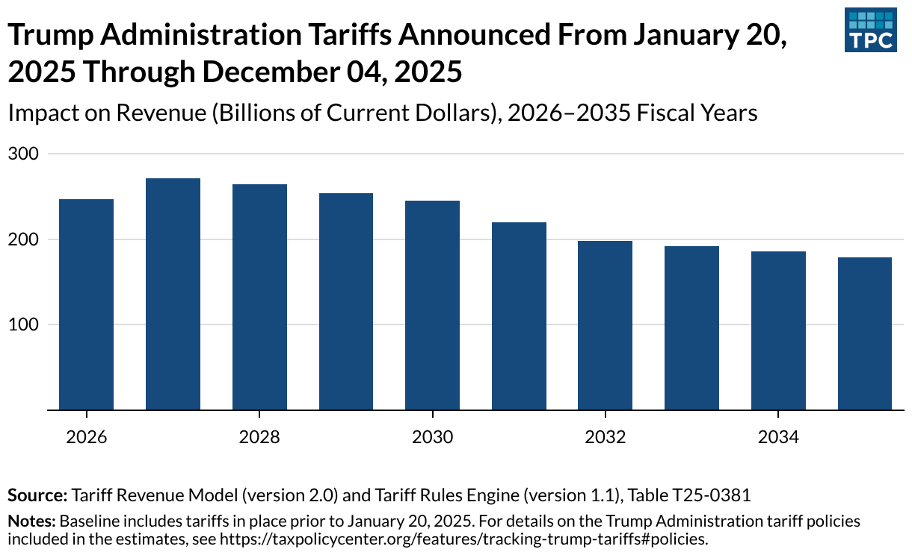
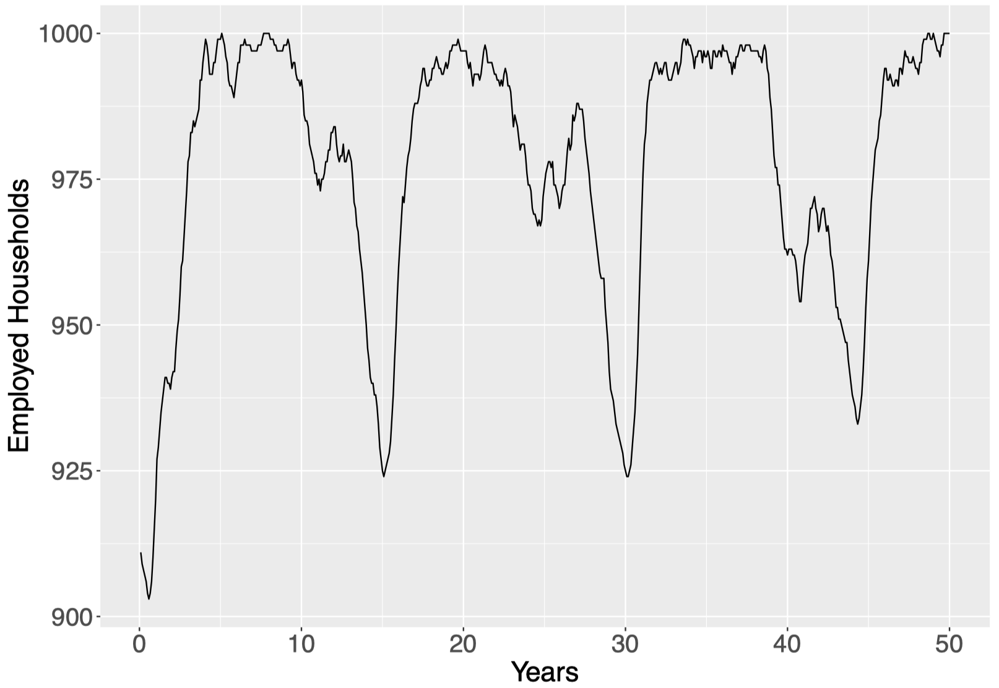
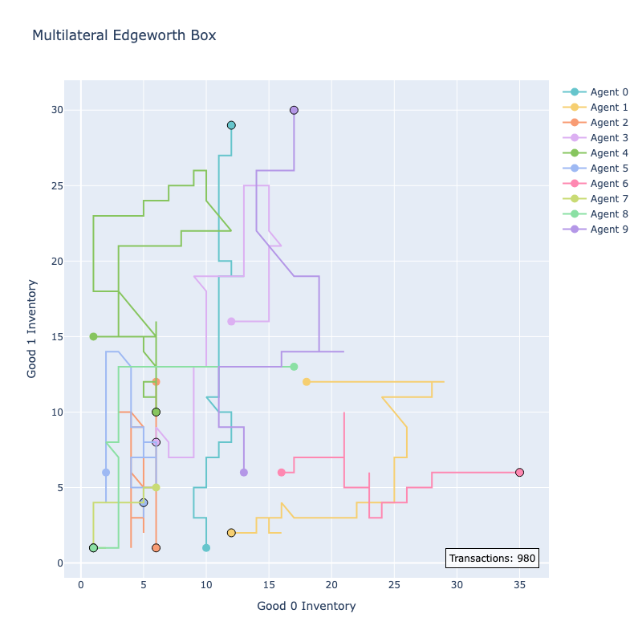
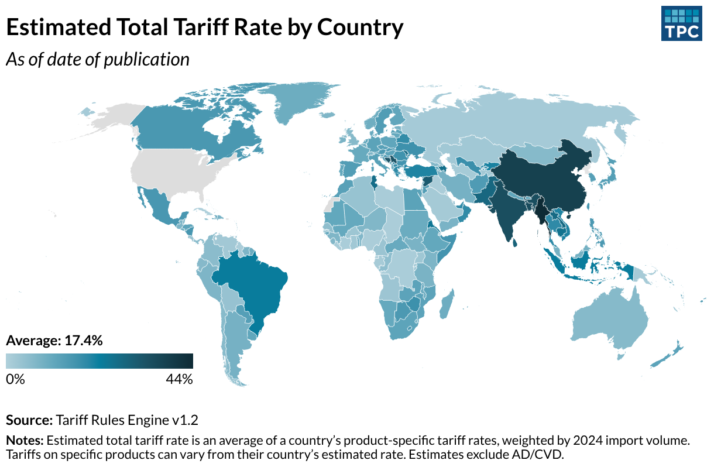
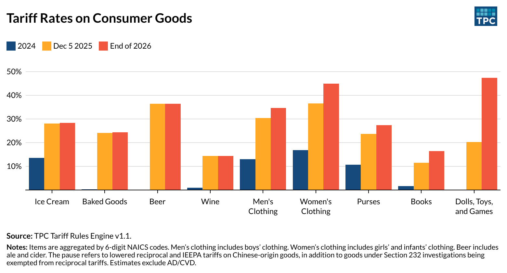
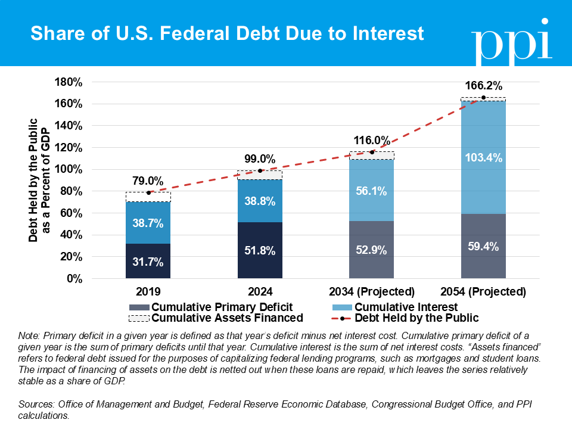
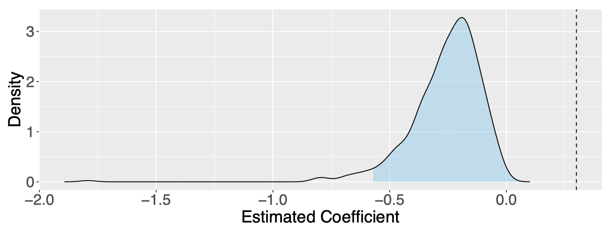

# Economic Research

---

## Microsimulation

### [TPC Tariff Rules Engine](https://taxpolicycenter.org/resources/tax-model-resources/documentation-tax-policy-centers-business-tax-model)
To analyze rapidly-changing and complex tariff policies, we built a program that estimates a tariff rate for each product from each origin, for each policy, each day---resulting in 10 billion tariff rates per simulation. This is supported by a YAML-based rule-encoding system that requires no code for adding new policies. [Read more]([https://taxpolicycenter.org/resources/tax-model-resources/documentation-tax-policy-centers-business-tax-model])
 
 

 
 

### [TPC Tariff Supply Chain Model](https://taxpolicycenter.org/resources/tax-model-resources/documentation-tax-policy-centers-business-tax-model)
Tariffs on final goods are determined by tariffs on their intermediate inputs. We use input-output tables to map how goods feed into one another, and estimate final burden and price changes. [Read more]([https://taxpolicycenter.org/resources/tax-model-resources/documentation-tax-policy-centers-business-tax-model])
 
 

 
 

### [TPC Tariff Revenue Model](https://taxpolicycenter.org/resources/tax-model-resources/documentation-tax-policy-centers-business-tax-model)
We build a R model that can generally accommodate rapidly changing tariff policy and produce [revenue estimates](https://taxpolicycenter.org/model-estimates/T25-0373). [Read more]([https://taxpolicycenter.org/resources/tax-model-resources/documentation-tax-policy-centers-business-tax-model])
 
 

 
 

### [Macroeconomic Agent-Based Model](https://github.com/johnthwong/mabm)
A macroeconomy simulated with two types of software agents: households that decide whom to buy from and work for, and firms that decide headcount, wages, and prices. This is a [Lengnick](https://doi.org/10.1016/j.jebo.2012.12.021) model, which shows that even without exogenous shocks, recessions can just emerge from economic agents temporarily failing to coordinate with each other. [View on Github](https://github.com/johnthwong/mabm)
 
 

 
 

### [Agent-Based General Equilibrium Model](https://github.com/johnthwong/bi-exchange)
An agent-based model of a general bilateral exchange problem of any *A* agents and any *N* goods. This model uses boundedly rational agents, in the sense that the agents iteratively make trades without knowing the optimal quantities that maximize their utility. It can obtain a decentralized, numerical solution to a general equilibrium problem. [View on Github](https://github.com/johnthwong/bi-exchange)
 
 

 
 

---

## Blogs

### [Tax Policy Center Tariff Tracker](https://taxpolicycenter.org/features/tracking-trump-tariffs)
TPC's latest analysis on tariffs visualized. [Read more](https://taxpolicycenter.org/features/tracking-trump-tariffs)
 
 

 
 

### [TPC: How Do Tariffs Flow Through Supply Chains?](https://taxpolicycenter.org/taxvox/how-do-tariffs-flow-through-supply-chains)
I explain how TPC applies input-output analysis for tariffs.
 
 

### [Modeling Tariff Complexity: How TPC Tracks Billions of Policy Combinations](https://taxpolicycenter.org/taxvox/modeling-tariff-complexity-how-tpc-tracks-billions-policy-combinations)
I introduce TPC's Tariff Rules Engine and its capabilities.
 
 

### [Brookings: Recent Tariffs Threaten Residential Construction](https://www.brookings.edu/articles/recent-tariffs-threaten-residential-construction/)
Using TPC’s tariff model, Elena Patel, Robert McClelland, and I calculated that tariffs will add roughly $30 billion to the costs of investment in residential structures. [Read more](https://www.brookings.edu/articles/recent-tariffs-threaten-residential-construction/)
 
 

### [TPC: Supreme Court Ruling on IEEPA Tariffs Could Ease Cost Burdens, But Less Than You Might Think](https://taxpolicycenter.org/taxvox/supreme-court-ruling-ieepa-tariffs-could-ease-cost-burdens-less-you-might-think)
We use the tariff rules engine to analyze the marginal impact of IEEPA tariffs and simulate new tariffs. [Read more](https://taxpolicycenter.org/taxvox/supreme-court-ruling-ieepa-tariffs-could-ease-cost-burdens-less-you-might-think)
 
 

### [TPC Shows Who Pays Trump Administration’s Tariffs And Who Could Gain From $2,000 Dividend](https://taxpolicycenter.org/taxvox/tpc-shows-who-pays-trump-administrations-tariffs-and-who-could-gain-2000-dividend)
The distribution of tariff burden, generated with our latest tariff rules engine and input-output model. [Read more](https://taxpolicycenter.org/taxvox/tpc-shows-who-pays-trump-administrations-tariffs-and-who-could-gain-2000-dividend)
 
 

### [TPC: Tariffs On Movies Would Face Very High Hurdles](https://taxpolicycenter.org/taxvox/tariffs-movies-would-face-very-high-hurdles)
Janet Holtzblatt, Rob McClelland, and I explore the difficulties of levying import duties on intellectual property. [Read more](https://taxpolicycenter.org/taxvox/tariffs-movies-would-face-very-high-hurdles)
 
 

### [TPC: Too Many Goods Are About To Face Historically High Tariffs](https://taxpolicycenter.org/taxvox/too-many-goods-are-about-face-historically-high-tariffs)
Tariffs are typically levied on countries. But consumers buy goods by category, not by country of origin. In my first piece for Urban-Brookings Tax Policy Center, Robert McClelland and I use our revamped tariff model to translate the effects of country-based tariffs on major consumer goods. [Read more](https://taxpolicycenter.org/taxvox/too-many-goods-are-about-face-historically-high-tariffs)
 
 

 
 

### [PPI: Most U.S. Government Borrowing Just Pays for More Borrowing](https://www.progressivepolicy.org/most-u-s-government-borrowing-just-pays-for-more-borrowing/)
Nearly 40 percent of U.S. government debt today was issued just to cover interest on previous debt, and this problem is poised to worsen as recent borrowing accrues interest and Congress further cuts revenue. [Read more](https://www.progressivepolicy.org/most-u-s-government-borrowing-just-pays-for-more-borrowing/)
 
 

 
 

---

## Working Papers

### [The Problem With Historical Instrumental Variables](https://github.com/johnthwong/mendelian/blob/main/note.pdf)
Many instrumental variable papers that identify treatment variations over long time periods are misspecified. I use difference equations, VAR representations, and Monte Carlo simulations to demonstrate this. I also propose a remedial two-stage-least-squares specification to correct for bias. [Read more](https://github.com/johnthwong/mendelian/blob/main/note.pdf)
 
 

 
 

### [The Causal Effect of Regulation on Economic Growth: Evidence From the US States](https://github.com/johnthwong/reg-growth/blob/3a239c586cdf3bfa44faa8478f17fcceec967a04/write-up.pdf)
I wrote a paper with [Patrick McLaughlin](https://patrickamclaughlin.com) on using state age to estimate how increasing regulation causally affects growth. This project leverages the QuantGov project's [State RegData](https://www.quantgov.org).

**Read more:**
 
[Mercatus Working Paper (Dec 20 2024)](https://www.mercatus.org/research/working-papers/causal-effect-regulations-economic-growth-evidence-us-states)
 
[SSRN Preprint](https://dx.doi.org/10.2139/ssrn.5191651)
 
[Latest Working Draft](https://github.com/johnthwong/reg-growth/blob/3a239c586cdf3bfa44faa8478f17fcceec967a04/write-up.pdf)
 
 

 
 

### Learning What We Like
A model of preference discovery with [Alex Tabarrok](https://alextabarrok.com).
 
 

### How Monopolistic is iMessage?
To what extent does iMessage confer a monopolistic advantage to Apple? I estimate how much the service changes the demand elasticity for iPhones.
 
 