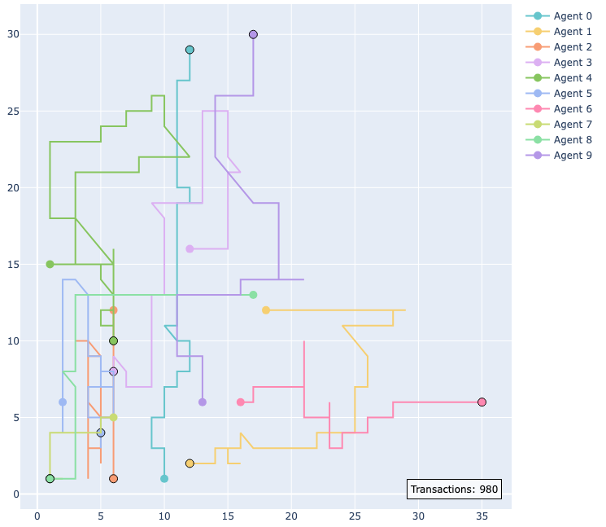

# Economic Research

---

## Simulations

### Tax Policy Center Tariff Revenue Model
We build a R model that can generally accommodate rapidly changing tariff policy and produce revenue estimates.

### Tax Policy Center Tariff Distribution Model
Tariffs on final goods are determined by tariffs on their intermediate inputs. We use input-output tables to map how goods feed into one another, and estimate final burden and price changes. 

### [Macroeconomic Agent-Based Model](https://github.com/johnthwong/mabm)
A macroeconomy simulated with two types of software agents: households that decide whom to buy from and work for, and firms that decide headcount, wages, and prices. This is a [Lengnick](https://doi.org/10.1016/j.jebo.2012.12.021) model, which shows that even without exogenous shocks, recessions can just emerge from economic agents temporarily failing to coordinate with each other. [View on Github](https://github.com/johnthwong/mabm)
 
 

 
 

### [Agent-Based General Equilibrium Model](https://github.com/johnthwong/bi-exchange)
An agent-based model of a general bilateral exchange problem of any *A* agents and any *N* goods. This model uses boundedly rational agents, in the sense that the agents iteratively make trades without knowing the optimal quantities that maximize their utility. It can obtain a decentralized, numerical solution to a general equilibrium problem. [View on Github](https://github.com/johnthwong/bi-exchange)
 
 

 
 

### [Modeling the Distributional Impact of Treating Employer FICA Taxes as Employee's Taxable Income](https://policyengine.org/us/policy?focus=policyOutput.winnersAndLosers.incomeDecile&reform=79249&region=us&timePeriod=2025&baseline=2&dataset=enhanced_cps)
I coded a reform in PolicyEngine's microsimulation model for a client. The proposal would exempt Social Security benefits from taxation, while treating the employer’s share of Social Security and Medicare taxes as additional taxable income for employees. We model its impact on federal deficits and inequality. [View on PolicyEngine](https://policyengine.org/us/policy?focus=policyOutput.winnersAndLosers.incomeDecile&reform=79249&region=us&timePeriod=2025&baseline=2&dataset=enhanced_cps)
 
 

 
 

---

## Working Papers/Works in Progress

### [The Problem With Historical Instrumental Variables](https://github.com/johnthwong/mendelian/blob/main/note.pdf)
Many instrumental variable papers that identify treatment variations over long time periods are misspecified. I use difference equations, VAR representations, and Monte Carlo simulations to demonstrate this. I also propose a remedial two-stage-least-squares specification to correct for bias. [Read more](https://github.com/johnthwong/mendelian/blob/main/note.pdf)
 
 

 
 

### [The Causal Effect of Regulation on Economic Growth: Evidence From the US States](https://github.com/johnthwong/reg-growth/blob/3a239c586cdf3bfa44faa8478f17fcceec967a04/write-up.pdf)
I wrote a paper with [Patrick McLaughlin](https://patrickamclaughlin.com) on using state age to estimate how increasing regulation causally affects growth. This project leverages the QuantGov project's [State RegData](https://www.quantgov.org).

**Read more:**
 
[Mercatus Working Paper (Dec 20 2024)](https://www.mercatus.org/research/working-papers/causal-effect-regulations-economic-growth-evidence-us-states)
 
[SSRN Preprint](https://dx.doi.org/10.2139/ssrn.5191651)
 
[Latest Working Draft](https://github.com/johnthwong/reg-growth/blob/3a239c586cdf3bfa44faa8478f17fcceec967a04/write-up.pdf)
 
 

 
 

### [How Complex Has the Tax Code Become? A Measure Derived from Tax Liability](https://github.com/PolicyEngine/policy-complexity)
I construct a direct empirical measure of tax code complexity that encompasses the incidence of all federal and state taxes and the utilization of all deductions and credits. [View on Github](https://github.com/PolicyEngine/policy-complexity)
 
 

### Learning What We Like
A model of preference discovery with [Alex Tabarrok](https://alextabarrok.com).
 
 

### Social Security: Cost-Benefit Measured as Expected Spending Per Unit of Risk Reduction
I investigate whether various Social Security programs, in conjunction, provide additional value of risk insurance per dollar that is overlooked by separate evaluations of each program. I am using Health and Retirement Study panel data to examine how much the beneficiaries of retirement and disability income payments overlap.
 
 

### How Monopolistic is iMessage?
To what extent does iMessage confer a monopolistic advantage to Apple? I estimate how much the service changes the demand elasticity for iPhones.
 
 

### What Is the Cause of Interest Rate Volatility in Interbank Markets?
I demonstrate that contrary to conventional wisdom, interest rate volatility in Hong Kong isn't caused by liquidity crunches subsequent to initial public offerings.
 
 

### Income Mobility and Regulation: Evidence from Canadian Immigrants
Using a panel of measures of immigrant mobility from Statistics Canada and a shift-share instrument, we measure how much liberalization affects immigrants' economic outcomes. With Vincent Geloso and James Dean.
 
 

---

## Public Writing

### [Brookings: Recent Tariffs Threaten Residential Construction](https://www.brookings.edu/articles/recent-tariffs-threaten-residential-construction/)
Using TPC’s tariff model, Elena Patel, Robert McClelland, and I calculated that tariffs will add roughly $30 billion to the costs of investment in residential structures. [Read more](https://www.brookings.edu/articles/recent-tariffs-threaten-residential-construction/)
 
 

### [Tax Policy Center Tariff Tracker](https://taxpolicycenter.org/features/tracking-trump-tariffs)
I explain the major categories of tariffs, how they stack, and what the estimated total tariff rate on each country is. [Read more](https://taxpolicycenter.org/features/tracking-trump-tariffs)
 
 

 
 

### [TPC: Too Many Goods Are About To Face Historically High Tariffs](https://taxpolicycenter.org/taxvox/too-many-goods-are-about-face-historically-high-tariffs)
Tariffs are typically levied on countries. But consumers buy goods by category, not by country of origin. In my first piece for Urban-Brookings Tax Policy Center, Robert McClelland and I use our revamped tariff model to translate the effects of country-based tariffs on major consumer goods. [Read more](https://taxpolicycenter.org/taxvox/too-many-goods-are-about-face-historically-high-tariffs)
 
 

 
 

### [PPI: Most U.S. Government Borrowing Just Pays for More Borrowing](https://www.progressivepolicy.org/most-u-s-government-borrowing-just-pays-for-more-borrowing/)
Nearly 40 percent of U.S. government debt today was issued just to cover interest on previous debt, and this problem is poised to worsen as recent borrowing accrues interest and Congress further cuts revenue. [Read more](https://www.progressivepolicy.org/most-u-s-government-borrowing-just-pays-for-more-borrowing/)
 
 

 
 
